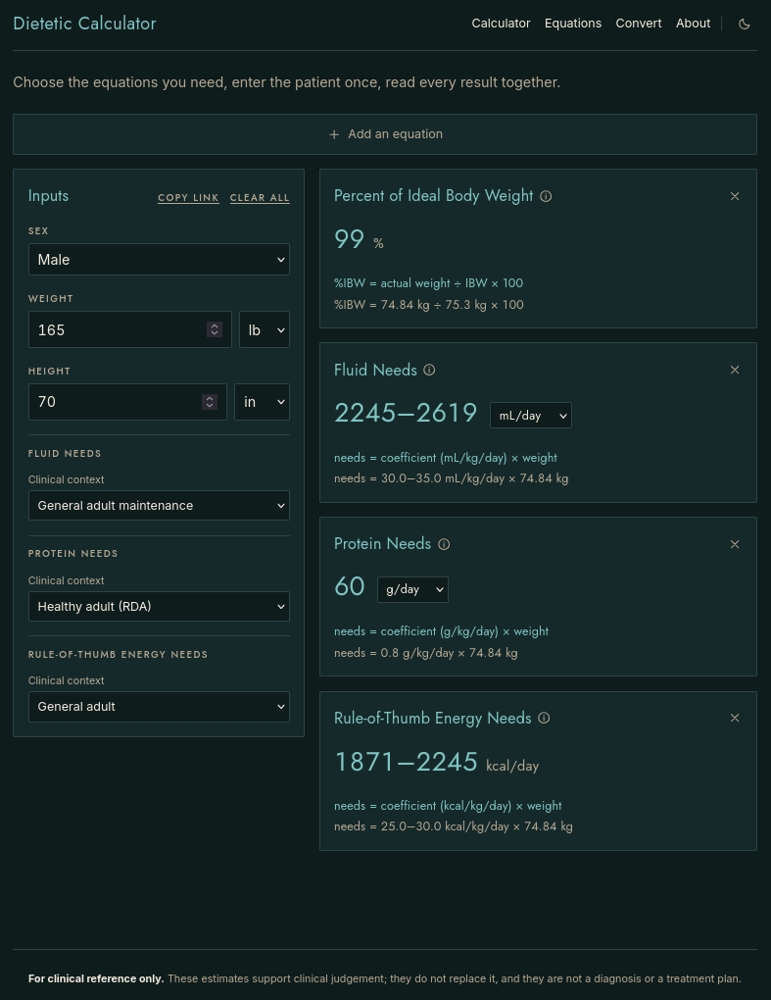

<h1 align="center">Hi 👋, I'm Curtis</h1>
<h3 align="center">A software engineer, indie game dev, and cat enthusiast living in Oregon</h3>

<h1 />

<h3 align="center">I primarily on GoLang and TypeScript services professionally</h3>

  
  
  
  
  
  
  
  

<h3 align="center">I’m currently working on <a href="https://dieteticcalc.com">Dietetic Calculator</a></h3>

Enter the patient once; every equation answers together

  
  
  
  

  

<h1 />

<h3 align="center">I’m currently working on Hexed Haven, a turn-based tactical roguelike</h3>

Hex-grid combat, deterministic mechanics, and a medieval fantasy setting

  
  
  

  

<h3 align="center">📫 How to reach me</h3>

  

